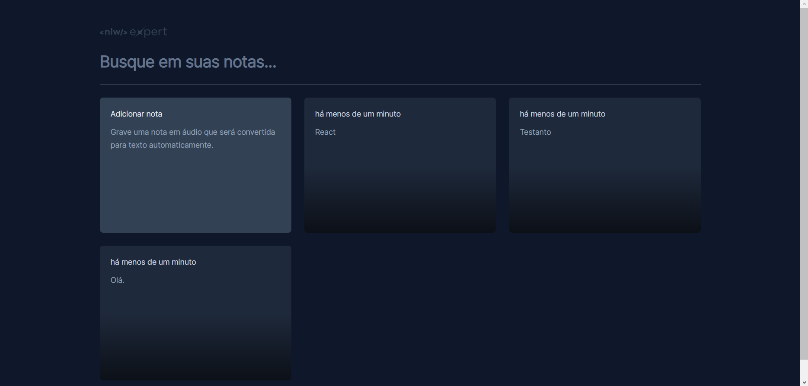

  
  

  ## 💻 Projeto
  Evento NLW Expert da Rocketseat, Trilha React! Neste evento, desenvolvi uma aplicação que converte notas de áudio em texto usando a API nativa de reconhecimento de voz do navegador. O projeto é focado em boas práticas, acessibilidade, organização de código e usabilidade.

  ## ✏️ Desafio de alterações feitas por mim
  - Adicionar opção de editar uma nota.
  - Ao salvar uma nota o Dialog se fecha automaticamente.

  ## 🚀 Tecnologias
  - React
  - TypeScript
  - TailwindCSS
  - Vite
